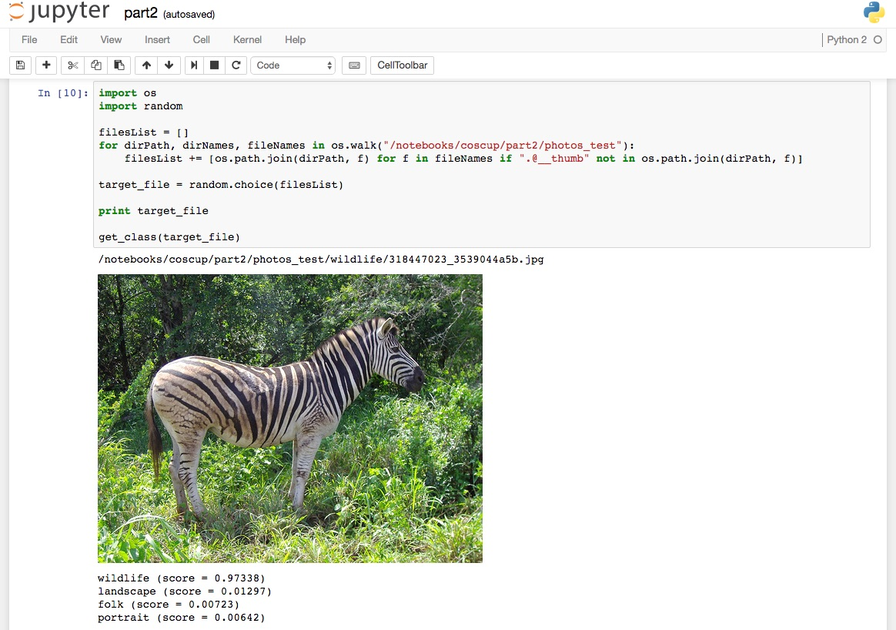

# coscup 2016 NAS也可以揀土豆 Demo

> slideshare [Nas 也可以揀土豆](http://www.slideshare.net/cagechung/nas-65206227)





clone repo

```sh
// clone
$ git clone git@github.com:cage1016/coscup2016-nas-session.git demo
$ cd demo
```

prepare tensorflow docker image

```sh
$ docker pull gcr.io/tensorflow/tensorflow:latest
```

run container

```sh
$ docker run -d --name tensorflow-demo -p 8888:8888 -v $(pwd):/notebooks/coscup gcr.io/tensorflow/tensorflow:latest
```

[http://localhost:8888/tree/coscup](http://localhost:8888/tree/coscup)


## retrain inception model

### part1
  - 68.8% finally test accuracy
  - 5000 times retrain iterator
  - 23,666 images from Flickr photos/Google search
  - labels: Art x 4545 , Folk x 4782, Landscape x 3379 Portrait  x 3706, Sport  x 4967, Wildlife x 2887

### part2
  - 89.0% finally test accuracy
  - 4000 times retrain iterator
  - 10,349 images from Flickr photos
  - labels: Folk x 2083, Landscape x 3497 Portrait  x 3215, Wildlife x 1554

### part3
  - 97.0% finally test accuracy
  - 4000 times retrain iterator
  - 13,685 images from Flickr photos
  - labels: Imagenet 11 categories, Agaric/bolete/buckeye, horse chestnut, conker/coral fungus/ear, spike, capitulum/earthstar/gyromitra/hen-of-the-woods, hen of the woods, Polyporus frondosus, Grifola frondosa/peanut/stinkhorn, carrion fungus/toilet tissue, toilet paper, bathroom tissue + peanut
